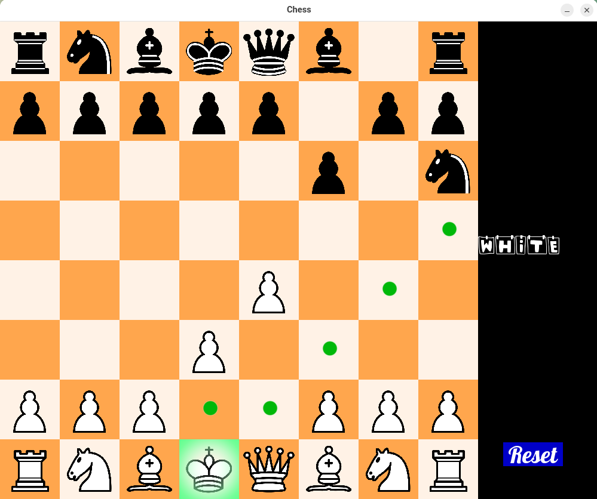
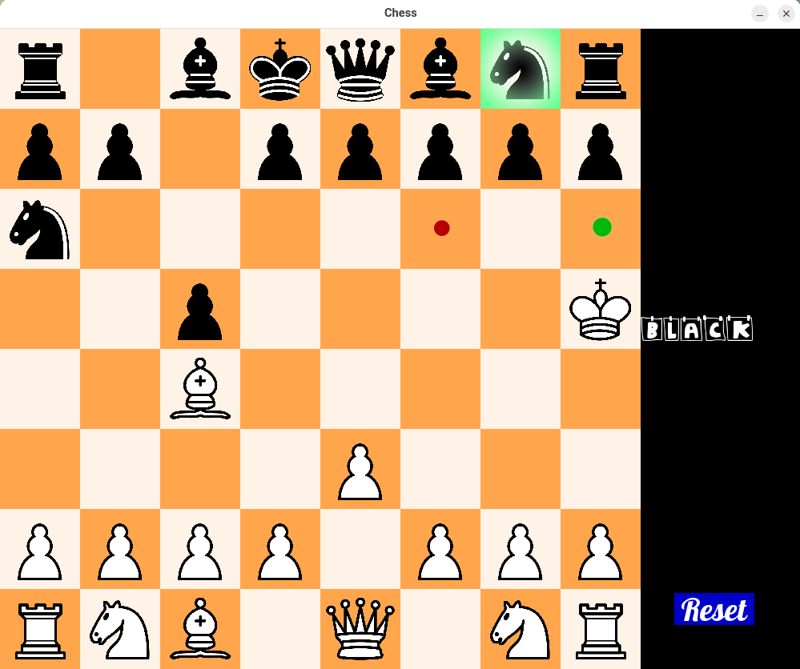
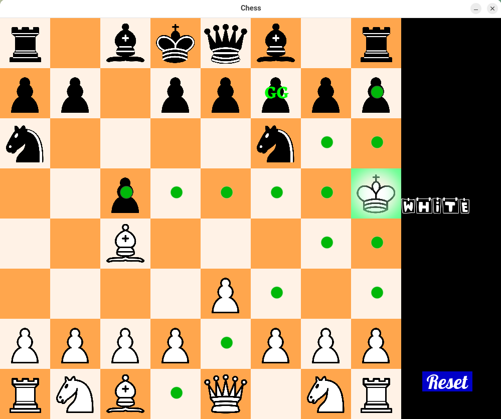
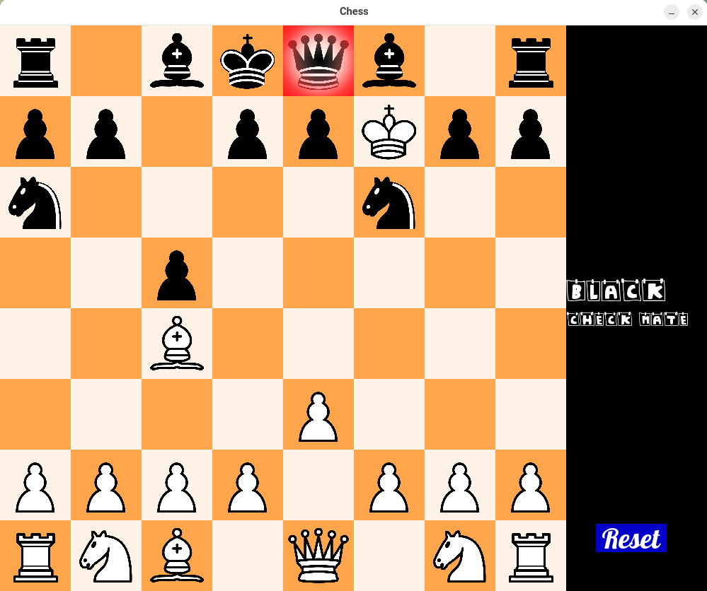

Absolutely! Below is the **entire `README.md` content in a single Markdown block**, ready to copy and paste as-is:

````markdown
# ♟️ Graphical Chess Game with SFML

This is a **graphical chess game** built in **C++ using SFML**, designed to offer both a clean user experience and insightful gameplay feedback. The app includes features such as move hints, real-time game status updates (check, checkmate), and advanced detection of imminent checkmates within five moves.

## 🧠 Features

- 🎨 **Graphical Interface** using SFML.
- 👥 **Turn Indicator** showing whose turn it is.
- ✅ **Legal Move Hints**: Click on any piece to see its possible legal moves marked with green dots.
- ⚠️ **Game State Alerts**:
  - Alerts for **check** and **checkmate**.
  - Detects and highlights when a move leads to a **forced checkmate in 5 or fewer moves** (i.e., your opponent has no escape after your move).

---

## 🖼️ Screenshots

> Below are some snapshots showing different states of the game:

<!-- Replace with actual paths or URLs to your images -->
<p align="center">
  
  
</p>
<p align="center">
  
  
</p>

---

## 🚀 How to Run

### 🧱 Build Instructions

1. Make sure you have **CMake** and **SFML** installed.
2. Clone the repository:
   ```bash
   git clone https://github.com/TheHamidrezaMafi/Smart-Chess.git
````

3. Create a build directory and compile:

   ```bash
   mkdir build
   cd build
   cmake ..
   make
   ./chess
   ```

### ▶️ Run the Game

After building the project, you can run the executable. Upon launching, the app will prompt you in the terminal to input the **initial position of the chess board**.

Use the following format (8 lines, top to bottom), where:

* First two letters indicate piece and color (`R` = Rook, `N` = Knight, `B` = Bishop, `Q` = Queen, `K` = King, `P` = Pawn)
* Last letter indicates color: `B` = Black, `W` = White
* `--` represents an empty square

#### ♟️ Sample Input:

```
RB NB BB QB KB BB NB RB
PB PB PB PB PB PB PB PB
-- -- -- -- -- -- -- --
-- -- -- -- -- -- -- --
-- -- -- -- -- -- -- --
-- -- -- -- -- -- -- --
PW PW PW PW PW PW PW PW
RW NW BW QW KW BW NW RW
```

You can customize this layout to set up different board positions.

---

## 📌 Notes

* You can freely reposition pieces before gameplay to explore openings or test scenarios.
* The game is intended for educational, testing, and entertainment purposes with a visual and interactive twist.

---
